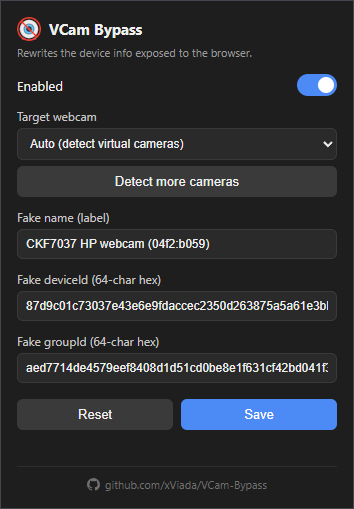
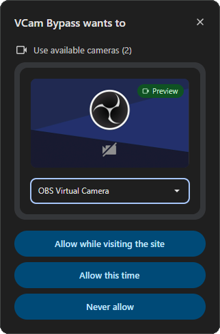

# VCam Bypass (Chrome extension)

A Manifest V3 extension that makes **any virtual camera** (OBS Virtual
Camera, ManyCam, DroidCam, iVCam, Snap Camera, etc.) appear to any website as a **normal
physical webcam**, by rewriting the device info the browser exposes: `label`,
`deviceId`, `groupId` and the full `getSettings()` / `getCapabilities()` surface.
It emulates a **real webcam model** (resolution, frame rate, facing mode, focus,
exposure, white balance and image controls) so a virtual camera doesn't give
itself away by exposing none of the hardware controls a physical camera has.
It can do the same for the **microphone**, so a built-in webcam + mic combo
stays consistent (see [Microphone](#microphone)).

Everything happens inside the page context (JavaScript). It does not modify the
operating system or the actual video.

## How it works

- `inject.js` runs in the **MAIN world** (page context) at `document_start` and
  patches:
  - `navigator.mediaDevices.enumerateDevices()`: it rewrites the target device's
    `label`, `deviceId` and `groupId` to physical-webcam values. The target is
    the one you picked in the dropdown; a target must be selected for the mask
    to do anything. With **Hide other devices** on, every camera and microphone
    that isn't the emulated one is dropped from the list.
  - `navigator.mediaDevices.getUserMedia()` (and the legacy variants): translates
    the fake `deviceId` in the constraints back to the real one before requesting
    the stream, then masks the video tracks: it spoofs the `label` and
    synthesizes a full physical-camera `getSettings()` / `getCapabilities()` from
    the selected model profile, while keeping the real (canvas-verifiable)
    resolution and frame rate. When mic mask is on, audio devices/tracks are
    rewritten the same way. With **Hide other devices** on, a request that
    doesn't name a device is pinned to the emulated one, so a page can't open a
    device it was told doesn't exist.
  - `MediaStreamTrack.prototype.getSettings` / `getCapabilities` to mask the real
    `deviceId` (and rebuild the camera surface) on any track.
- `profiles.js` is loaded in the **MAIN world** right before `inject.js` (and
  reused by the popup and service worker). It holds the capability profiles for
  real webcam models and builds the spoofed `getCapabilities()` / `getSettings()`
  objects.
- `bridge.js` runs in the **ISOLATED world**, reads the config from
  `chrome.storage.local` and sends it to `inject.js` via a `CustomEvent`. It also
  collects the real webcam names visible on the page and stores them for the popup.
- `background.js` is a service worker that, on install, generates and persists
  random, stable `deviceId`/`groupId` values, seeds the default capability profile
  and picks a random webcam name from the usb.ids list (with a fallback default).
- `popup.html` / `popup.js` provide the configuration UI, including a **Test it**
  button (opens `test.html`) and a **How to use** button (opens `guide.html`).
- `request.html` / `request.js` is a page that requests camera permission to read
  the real camera names.
- `test.html` / `test.js` opens the camera and shows exactly what a website sees
  (label, ids, settings and capabilities), so you can confirm the mask works.
  Because content scripts don't run on extension pages, it loads `profiles.js`,
  `inject.js` and `bridge.js` itself to mirror a real page.
- `guide.html` is a short step-by-step usage guide.

## Installation (load unpacked)

1. Make sure the virtual camera you want to mask is **installed and running**
   so its device exists.
2. Open Chrome and go to `chrome://extensions`.
3. Enable **Developer mode** (top right).
4. Click **Load unpacked** and select this project folder.
5. (Optional) Pin the extension and open its popup to pick the target webcam,
   choose the emulated model, or fine-tune the name, IDs and capabilities.

## Usage

- After installing or changing the config in the popup, **reload the page** where
  you use the camera so the changes take effect.
- In the site's camera selector, the virtual camera will appear with the fake name
  (e.g. `Integrated Webcam (1bcf:2b95)`, the `name (vendor:product)` format
  Chrome uses for real USB webcams).

## Configuration (popup)

- **Enabled**: turns the mask on/off without uninstalling. You must select a
  target webcam first; the mask can't be enabled without one.
- **Hide other devices** (the eye button next to the on/off switch): while the
  mask is enabled, websites only see the emulated devices. Every other webcam
  and microphone is removed from `enumerateDevices()`, and a `getUserMedia()`
  call that doesn't name a device is pinned to the emulated one (falling back to
  normal behaviour if that device is busy or unplugged). Cameras are only
  filtered when the target camera is actually present, and microphones only when
  the mic mask is on, so a page never ends up with an empty device list.
  Speakers and other outputs are left alone. If several real devices map onto
  the same emulated identity (two webcams with an identical label, or a device
  that exposes the same mic twice), they collapse into a single entry, since no
  real machine ever repeats a `deviceId`.
- **Target webcam**: dropdown with the available webcams to choose which one to
  act on. A webcam must be selected — if none is available, use **Detect cameras**
  first, then pick one. The list is filled in two ways:
  - Automatically, from sites where you have already granted camera permission
    (collected by `bridge.js`).
  - With the **Detect cameras** button, which opens an extension tab where Chrome
    does show the permission dialog. After clicking **Allow**, the names appear in the
    dropdown.

   

- **Emulated model (capabilities)**: which real webcam to emulate (Logitech
  C920 / C922 / BRIO, Microsoft LifeCam, an integrated laptop cam, or a generic
  webcam). This defines the `getCapabilities()` / `getSettings()` a site sees —
  resolution, frame rate, facing mode, focus, exposure, white balance and image
  controls. Your stream's actual resolution and frame rate are kept as-is so they
  stay consistent if a site measures them from the video.
- **New identity**: generates a coherent identity — a real model with a matching
  name and fresh `deviceId` / `groupId`.
- **Advanced capabilities**: a collapsible section to edit everything by hand:
  the fake **name (label)**, **deviceId**, **groupId**, and every capability
  (facing mode, max resolution, max frame rate, white-balance / exposure / focus
  modes, and each image control as min / max / step / default). Editing any value
  switches the model to **Custom**; ranges are validated and clamped on save.

The fake **name** uses Chrome's real `name (vendor:product)` format. On a fresh
install `background.js` picks one randomly from the webcam entries of the
[usb.ids](http://www.linux-usb.org/usb.ids) list (falling back to
`Integrated Webcam (1bcf:2b95)`), while **New identity** uses the emulated
model's name. The **deviceId** / **groupId** are random 64-char hex generated on
install and kept stable, just like Chrome's real SHA-256 ids.

### Microphone

The **Mic mask** dropdown controls how microphones are handled:

Both masking modes rewrite the one microphone you select as **Target
microphone**; they differ only in the identity it gets. Neither borrows a mic you
didn't pick, so the popup refuses to enable the mask until you select one (or set
**Off**).

- **Auto**: the selected mic is passed off as the emulated camera's own built-in
  mic. It gets the camera's fake `groupId` and a matching label (e.g.
  `Microphone (Integrated Webcam) (1bcf:2b95)`), so sites see a real built-in
  webcam + mic combo even when the camera is virtual and the mic is a separate
  device.
- **Off** *(default)*: leaves microphones untouched, video only.
- **Custom**: same masking, but with the fake name, `deviceId` and `groupId` you
  set yourself.

Real mic names are detected together with cameras (the **Detect cameras** button
and granted pages request mic permission too).

## Structure

- `manifest.json` - MV3 definition and content-script registration.
- `inject.js` - patches the mediaDevices APIs (MAIN world).
- `profiles.js` - capability profiles for real webcam models and the builders for the spoofed getSettings/getCapabilities (shared by inject, popup and background).
- `bridge.js` - bridge between `chrome.storage` and the page (ISOLATED world).
- `background.js` - service worker that persists random deviceId/groupId, seeds the default capability profile and picks a random webcam name from usb.ids.
- `popup.html` / `popup.js` - configuration UI (with **Test it** and **How to use** buttons).
- `request.html` / `request.js` - page that requests camera and microphone permission and detects the real names.
- `test.html` / `test.js` - verification page that shows what a website sees when it opens your camera.
- `guide.html` - short how-to-use guide.

## Disclaimer

This software is provided **for educational and research purposes only**. The
author (**xViada**) is **not responsible** for any use, misuse, or consequences
arising from the use of this extension. You are solely responsible for ensuring
that your use complies with applicable laws, terms of service, and policies of
the websites or services you interact with. Use at your own risk.

## License

MIT — see [LICENSE](LICENSE). Copyright (c) 2026 [xViada](https://github.com/xViada).
